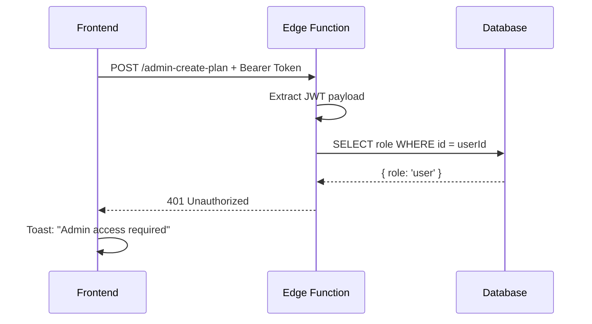

# Debugging Your 401 Errors

## Current Situation

You're getting **401 Unauthorized** when trying to create a subscription product. Here's what's happening:

### Root Causes (Most to Least Likely)

#### 1. **Your role is not set to 'admin'** ⚠️ MOST LIKELY
- **Evidence**: ProductManagement.jsx shows error toast with your current role
- **Check**: What error do you see on the Products page?
  - "Your role has not been set" → Role is NULL
  - "Your role: user" → Role is 'user' (default)
- **Fix**: See [ADMIN_SETUP_BOOTSTRAP.md](./ADMIN_SETUP_BOOTSTRAP.md)

#### 2. **Your user doesn't exist in public.users**
- **Evidence**: Edge function would return 404 "User not found"
- **Cause**: Auto-trigger didn't fire or public.users row wasn't created
- **Fix**: Manually insert row (see bootstrap guide)

#### 3. **JWT parsing is failing**
- **Evidence**: Return 401 from edge function
- **Cause**: Malformed token or parsing error
- **Fix**: Refresh/re-login

#### 4. **Supabase environment variables not set**
- **Evidence**: Function crashes immediately with null execution_id
- **Status**: ✅ FIXED - just verified all env vars are now set

## How to Diagnose

### Step 1: Check Product Management Page

1. Go to http://localhost:5173/dashboard/products
2. **What do you see?**

**If you see an error toast:** 
- ✅ Good sign - this means your auth is working
- ✅ JWT is being received by edge function
- ❌ But your role is not admin

**If you see the product creation form:**
- ✅ You're likely admin
- ❌ The 401 might be from Stripe or database issues

### Step 2: Check Supabase Function Logs

1. Go to: https://supabase.com/dashboard/project/ossyxxlplvqakowiwbok/functions/admin-create-plan
2. Click the latest function call in the logs
3. **Look for these log messages** (these were just added):
   - `=== START: admin-create-plan ===` - Function started
   - `Auth header present: yes` - Authorization header received
   - `Token extracted, length: XXX` - JWT parsed
   - `User ID from JWT: 8a3d...` - User identified
   - `User lookup result - error: ...` - Database query result
   - `User role: admin` - Role check passed
   - `Admin verified for user:` - Authorization successful

### Step 3: Check Your User in Database

Run in Supabase SQL Editor:

```sql
-- Check if you exist
SELECT id, email, role FROM public.users LIMIT 10;

-- Check your specific user (replace with your user ID)
SELECT * FROM public.users WHERE id = '8a3d7170-75b2-4a5a-aaf9-312735ae2bb0';
```

## The 401 Response Flow



## Solution Summary

### If you see "Your role: user" or "Your role has not been set"

The edge function is working correctly. It's rejecting your request because you don't have admin role.

**Fix:**
1. Go to Supabase Dashboard → SQL Editor
2. Run:
   ```sql
   UPDATE public.users SET role = 'admin' WHERE id = 'YOUR_USER_ID';
   ```
3. Refresh the page

### If you see a different error

Check the edge function logs (step 2 above) for the specific error message.

## Recent Changes (Just Deployed)

I've enhanced the `admin-create-plan` function with **much better logging**. Now when you try to create a product:

✅ You'll see exactly which step is failing  
✅ Error messages are much more specific  
✅ Environment variables are validated at startup  
✅ Database queries have error handling  

**To see these logs:**
1. Try creating a product (even if it fails)
2. Go to https://supabase.com/dashboard/project/ossyxxlplvqakowiwbok/functions/admin-create-plan
3. Click the latest log entry
4. Scroll through to find the error

## Next Steps

1. **Check your role** on the Products page
2. **Set it to admin** if needed (see ADMIN_SETUP_BOOTSTRAP.md)
3. **Try again**
4. **If still failing**, share the edge function logs and I can debug further

The enhanced logging will make it crystal clear exactly where the problem is.
